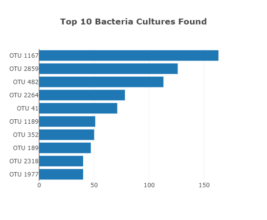
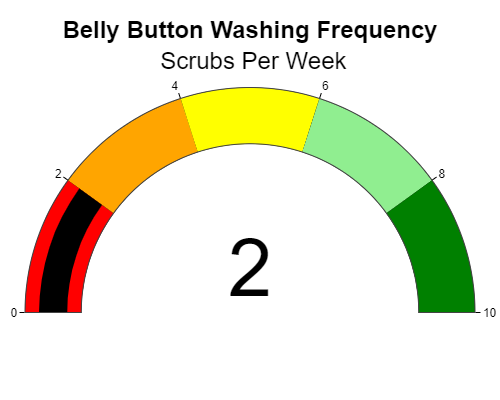
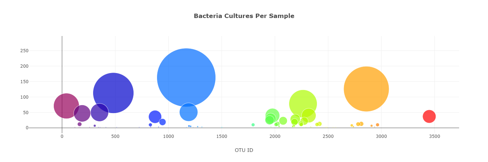

# Belly Button Biodiversity

This web application reads JSON data of bacteria found in the belly button for many different patients. The results are displayed as a horizontal bar chart, gauge chart and bubble chart.

 

 

